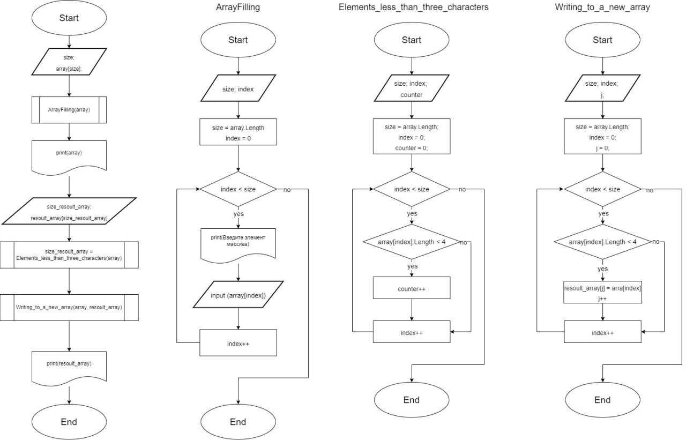

# Программа которая принамает массив и выдает массив с элиментами которые меньше или равны трем символам #

## Функции ##
1. Функция **ArrayFilling** - Заполняет массив данными с клавиатуры.
+ void ArrayFilling(string[] array) - *Создает не возвращаемую функцию* ArrayFilling *и помещает в нее массив* array *со строковыми элементами*
+ {
    + int size = array.Length; - *Создает переменную* size *с натуральными числами и записывает в нее количество элементов в массиве* array

    + for(int index = 0; index < size; index++) - *Создает цикл для прохождения всех элементов массива* array
    + {
        + Console.Write("Введите элимент масссива: "); - *выводит на экран "Введите элимент масссива: "*
        + array[index] = Console.ReadLine(); - *записывает в элемент массива данные принятые с клавиатуры*
    + }
+ }

2. Функция **Elements_less_than_three_characters** - считает сколько в массиве элементов брльше или ровно трем символам.
+ int Elements_less_than_three_characters(string[] array) - *Создает функцию* Elements_less_than_three_characters *которая в результате выдает натуральное число, и помещает в нее массив* array *со строковыми значениями*
+ {
    + int size = array.Length; - *Создает переменную* size *с натуральными числами и записывает в нее количество элементов в массиве* array
    + int counter = 0; - *Создает переменную* counter *с натуральными значениями и записывает в нее число 0. Этот элимент используется как счетчик*
    + for(int index = 0; index < size; index++) - *Создает цикл для прохождения всех элементов массива* array
    + {          
        + if (array[index].Length < 4) - *Сравнивает количество символов в элементе массива с 4*
            + counter++; - *Если условие сверху выполняется то в переменную* counter *прибовляется еденица*
    + }
    + return counter; - *Выводит результат выполнение этой функции переменную* counter
+ }

3. Функция **Writing_to_a_new_array** - копирует элементы которые больше или равны 3 символам в новый массив.
+ void Writing_to_a_new_array(string[] array, string[] resoult_array) - *Создает не возвращаемую функцию* Writing_to_a_new_array *и помещает в нее массивы* array *и* resoult_array *со строковыми элементами*
+ {
    + int size = array.Length; - *Создает переменную* size *с натуральными числами и записывает в нее количество элементов в массиве* array
    + int j = 0; - *Создает переменную* j *с натуральными значениями и записывает в нее число 0. Этот элимент используется как счетчик и как индекс массива* resoult_array
    + for(int index = 0; index < size; index++)
    + {      
        + if (array[index].Length < 4) - *Сравнивает количество символов в элементе массива с 4*
        + {   
            + resoult_array[j] = array[index]; - *Записывает значение в элемент массива* resoult_array *с индексом* j *из массива* array *с индексом* index
            + j++; - *К переменной* j *прибовляется еденица*
        + }
    + }
+ }

## Основной код ##
+ Console.Write("Количество элиментов в массиве: "); - *Выводит на экран "Количество элиментов в массиве: "*
+ int size = Convert.ToInt32(Console.ReadLine()); - *Создает переменную* size *с натуральными числами и записывает в нее число с клавиатуры*

+ string[] array = new string[size]; - *Создает массив* array *со строчными элиментами и длинной* size

+ ArrayFilling(array); - *Запускает функцию заполнения массива*
+ Console.Write(string.Join(", ", array)); - *Выводит на экран массив* array
+ Console.WriteLine(); - *Выводит на экран пустую строку*
+ int size_resoult_array = Elements_less_than_three_characters(array); - *Создает переменную* size_resoult_array *с натуральными числами и записывает в нее число полученное в результате выполнения функции* Elements_less_than_three_characters
+ string[] resoult_array = new string[size_resoult_array]; - *Создает массив* resoult_array *со строчными элиментами и длинной* size_resoult_array
+ Writing_to_a_new_array(array, resoult_array); - *запускает функцию* Writing_to_a_new_array
+ Console.Write(string.Join(", ", resoult_array)); - *Выводит на экран массив* resoult_array

## Блок схема ##

## Пример: ##
+ Количество элиментов в массиве: 6
+ Введите элимент масссива: Привет
+ Введите элимент масссива: Да
+ Введите элимент масссива: Машина
+ Введите элимент масссива: Нет
+ Введите элимент масссива: Дата
+ Введите элимент масссива: А
+ Привет, Да, Машина, Нет, Дата, А
+ Да, Нет, А